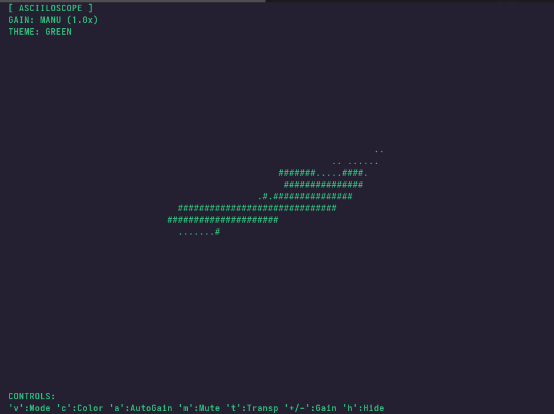

# Asciiloscope ∿



**Asciiloscope** is a real-time, low-latency audio visualizer for the Linux terminal. It simulates the aesthetic of vintage CRT oscilloscopes using ASCII characters.


## ✨ Features

* **Waveform Mode:** Visualizes raw audio amplitude over time.
* **XY Mode (Lissajous):** Classic vector scope visualization.
* **Auto-Gain:** Automatic signal scaling for optimal visibility.
* **Theming:** Multiple phosphor color emulations (Green, Amber, Cyan, Red, White).
* **Lightweight:** Zero graphical dependencies (runs in TTY).

### 🚀 Installation

### ⚡ Quick Install (Recommended)
Works on **Fedora**, **Ubuntu**, **Debian**, **Linux Mint**, and **Pop!_OS**.

Run this single command in your terminal:

```bash
curl -sSL https://raw.githubusercontent.com/altaugust/asciiloscope/main/install.sh | bash
```

### 📦 Manual Install

If you prefer to install manually using your package manager:

#### Fedora / RHEL / CentOS
```bash
sudo dnf copr enable altaugust/asciiloscope -y
sudo dnf install asciiloscope -y
```

#### Ubuntu / Linux Mint / Pop!_OS / Debian
```bash
sudo add-apt-repository ppa:altaugust/asciiloscope -y
sudo apt update
sudo apt install asciiloscope -y
```

## 🎮 Controls

| Key | Action |
| :--- | :--- |
| **h** | Toggle UI Overlay |
| **v** | Switch View Mode (Waveform / XY) |
| **a** | Toggle Auto-Gain |
| **+/-** | Manual Gain Control (0.1x steps) |
| **c** | Cycle Colors (Green, Amber, Cyan, Red, White) |
| **t** | Toggle Transparent Background |
| **m** | Mute / Freeze |
| **q** | Quit |

## 🛠️ Building from Source

Requirements: `gcc-c++`, `cmake`, `ncurses-devel`, `pulseaudio-libs-devel`

```bash
mkdir build && cd build
cmake ..
make
./asciiloscope
```

## 📜 License

MIT License. Created by [Pedro Augusto](https://github.com/altaugust).
